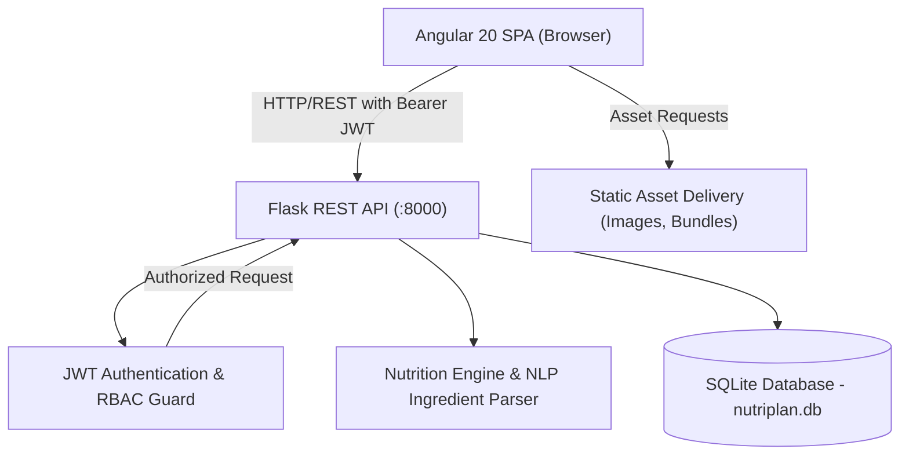
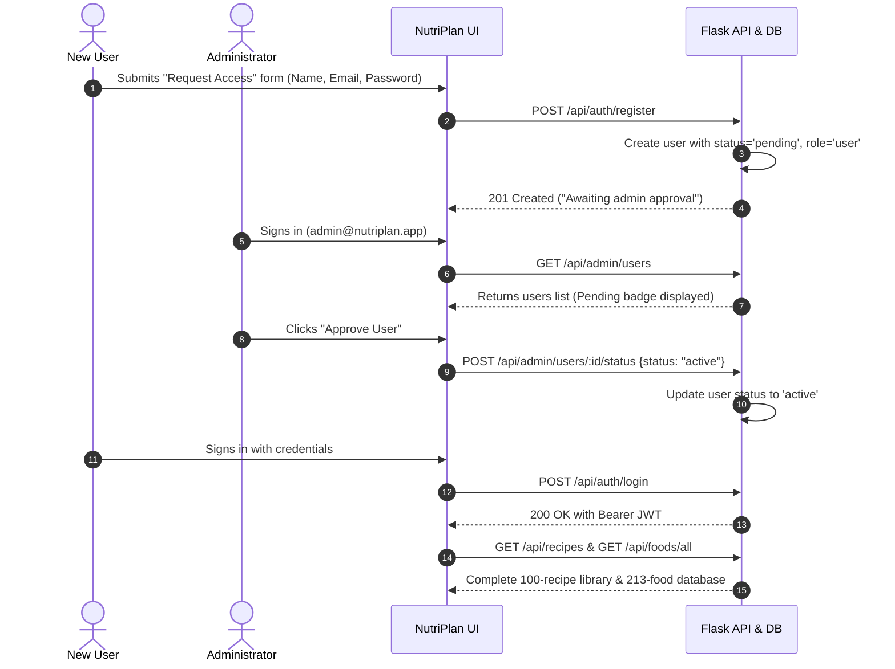
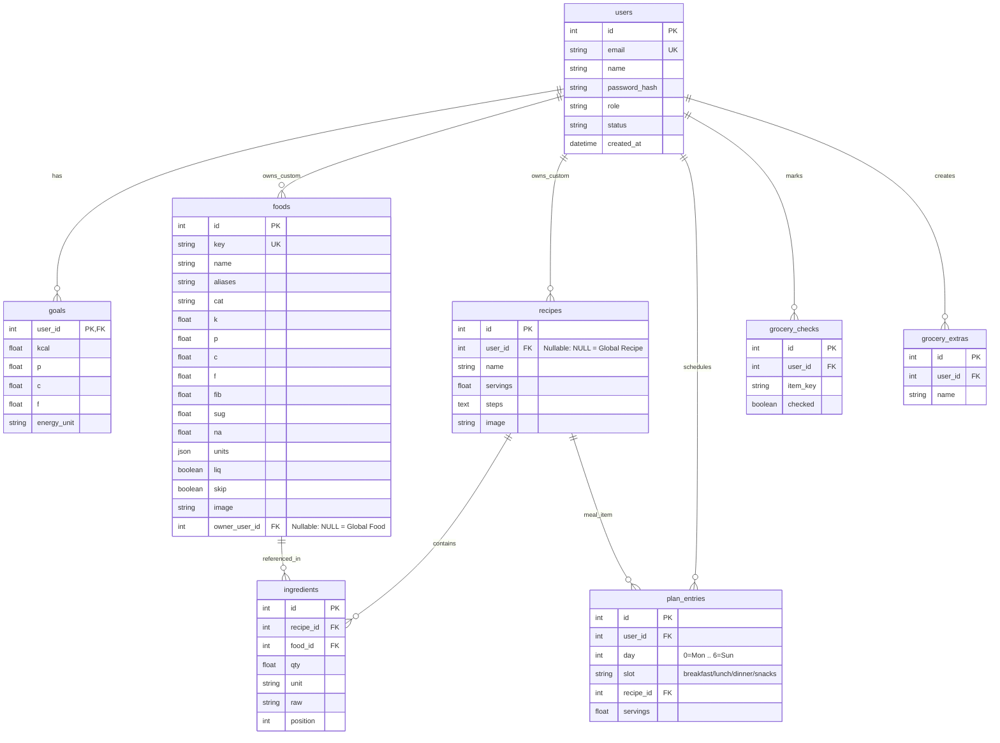

# 🥗 NutriPlan — Comprehensive Project Documentation

---

## 1. Executive Summary & Project Overview

**NutriPlan** is an enterprise-grade, full-stack nutrition tracking, recipe planning, and calorie analysis web application. Built with a modern **Angular 20** single-page frontend and a lightweight, high-performance **Python (Flask + SQLAlchemy)** backend backed by **SQLite**, NutriPlan combines culinary planning with scientific nutrition computation.

### Key Objectives
- **Centralized Food & Recipe Library**: Access a curated catalog of 200+ Indian and international ingredients with macro/micronutrient profiles, paired with 100 starter recipes (featuring South Indian staples, classic tiffins, and wholesome curries).
- **Universal Availability**: Every active user—whether an administrator, demo user, or newly registered member—has instant access to the complete global library of recipes and foods, with the ability to create and manage custom items.
- **Intelligent Meal Scheduling**: Plan meals across a 7-day calendar for breakfast, lunch, dinner, and snacks, featuring interactive serving steppers and live macro calculations.
- **Automated Grocery Logistics**: Automatically generate aisle-categorized, checkbox-managed grocery shopping lists scaled to planned weekly portions.
- **Administrative Control**: Secure gatekeeping workflow where registration requests remain in `pending` status until reviewed and approved by an administrator.

---

## 2. System Architecture

NutriPlan follows a clean decoupled client-server architecture. The built Angular frontend single-page application (SPA) is hosted directly by Flask in production, or served via the Angular dev server during local development.



---

## 3. Technology Stack

| Layer | Technology | Key Highlights |
|---|---|---|
| **Frontend Framework** | **Angular 20** | Standalone components, Angular Signals, reactive state, new control flow syntax (`@if`, `@for`). |
| **Styling & Design System** | **Custom CSS & Glassmorphism** | Responsive flexbox/grid layout, smooth GPU animations, CSS variables, dark/light harmonious tones. |
| **Backend Runtime** | **Python 3.10+ / Flask** | Flask RESTful endpoints, Flask-CORS, PyJWT token security, Werkzeug password hashing. |
| **ORM & Database** | **SQLAlchemy + SQLite** | Foreign key relations, cascade delete rules, automatic schema migration on startup. |
| **Nutrition Computation** | **Custom Python Math Engine** | Exact gram conversions, portion scaling factor arithmetic, macro ratios (Protein, Carbs, Fat, Fiber, Sodium). |
| **Natural Language Parser** | **Regex & Heuristic Tokenizer** | Converts raw strings (`"1 1/2 cups basmati rice"`) into structured quantities, units, and matched food items. |

---

## 4. User Lifecycle & Access Control

NutriPlan features strict Role-Based Access Control (RBAC) and an admin approval workflow:



### Roles and Statuses
- **Roles**:
  - `admin`: Can access the Admin Portal, approve/disable users, reset passwords, change roles, delete users, and modify global recipes.
  - `user`: Can view global recipes, create custom recipes/foods, schedule weekly meals, log daily progress, and generate grocery lists.
- **Statuses**:
  - `pending`: Registered, cannot log in until approved.
  - `active`: Fully authorized to sign in.
  - `disabled`: Blocked from logging in by an administrator.

---

## 5. Database Schema & Data Models

The database consists of 8 interconnected tables defined in [`models.py`](file:///c:/Users/NAVADEEP/Downloads/NutriPlanApp/backend/models.py):



### Global vs. Custom Ownership Architecture
- **Global Foods (`foods.owner_user_id IS NULL`)**: System-wide reference items available to all users.
- **Custom Foods (`foods.owner_user_id = user.id`)**: Created by individual users; visible only to the creator.
- **Global Library Recipes (`recipes.user_id IS NULL`)**: 100 starter recipes accessible to all users for browsing, portion-scaling, and scheduling.
- **Custom Recipes (`recipes.user_id = user.id`)**: User-created recipes or customized forks of library recipes.

---

## 6. Core Application Features

### 6.1 Recipe Library & Custom Builder
- **100 Starter Recipes**: Includes breakfast tiffins (Idli, Masala Dosa, Pongal, Medu Vada), biryanis, dals, and healthy curries with photos and macro breakdowns.
- **Interactive Nutrition Computation**: Computes exact calories, protein, carbs, and fat per portion and total batch.
- **Portion Scaler**: Live scaling tool dynamically adjusts ingredient weights and measurements to target portion counts.
- **Natural Language Ingredient Parser**: Paste entire recipes with lines like `"200g paneer"`, `"1 1/2 cups basmati rice"`, or `"2 tbsp ghee"` — the backend automatically parses and matches ingredients against the database.
- **Safe Copy-On-Write**: Non-admin users who edit global recipes receive their own personalized custom clone without corrupting the public library.

### 6.2 Weekly Calendar Meal Planner
- **7-Day × 4-Meal Matrix**: Organizes Monday through Sunday into Breakfast, Lunch, Dinner, and Snacks.
- **Quick Steppers**: Fine-tune portions with `+0.5` / `-0.5` serving steppers with instantaneous daily calorie bar recalculations.
- **Daily Target vs. Actuals**: Visual progress indicators highlight days exceeding or under target calorie budgets.

### 6.3 Today Dashboard & Calorie Analyzer
- **Daily Goal Comparison**: Tracks calories and macronutrient intake (P/C/F) with animated percentage bars.
- **Micronutrient Tracking**: Monitors fiber, sugar, and sodium totals.
- **Unit Flexibility**: Supports instant switching between calories (`kcal`) and kilojoules (`kJ`).

### 6.4 Smart Grocery List Generator
- **Automatic Aggregation**: Aggregates ingredients across all scheduled weekly meals, scaled to portion counts.
- **Aisle / Category Grouping**: Groups items by aisle (Produce, Grains & Flours, Dairy, Spices & Oils, Proteins).
- **Persistent Checkboxes**: Syncs checked items in real time.
- **Custom Extras**: Allows users to add miscellaneous shopping items (e.g., foil, soap, paper towels).

### 6.5 Admin Portal & Security Controls
- **User Approvals**: One-click approval for newly registered users.
- **Account Controls**: Disable, re-enable, promote to admin, reset passwords, or delete accounts.
- **System Metrics**: Real-time stats on registered users, active plans, total recipes, and food items.

---

## 7. REST API Reference

All requests to `/api/*` (except auth registration/login) require an `Authorization: Bearer <JWT_TOKEN>` header.

### Authentication Endpoints
| Method | Endpoint | Description | Auth Required |
|---|---|---|---|
| `POST` | `/api/auth/register` | Register new user account (status: `pending`) | No |
| `POST` | `/api/auth/login` | Authenticate user & return JWT token | No |
| `POST` | `/api/auth/logout` | Clear session cookie | Yes |
| `GET` | `/api/auth/me` | Fetch currently authenticated user profile | Yes |

### Foods Endpoints
| Method | Endpoint | Description | Auth Required |
|---|---|---|---|
| `GET` | `/api/foods/all` | Fetch complete catalog (global + custom foods) | Yes |
| `GET` | `/api/foods?q=&limit=` | Search food items with fuzzy text matching | Yes |
| `POST` | `/api/foods` | Create a new custom food item | Yes |
| `GET` | `/api/foods/mine` | List all custom foods created by user | Yes |
| `DELETE` | `/api/foods/:id` | Delete a custom food item | Yes (Owner) |

### Recipe Endpoints
| Method | Endpoint | Description | Auth Required |
|---|---|---|---|
| `GET` | `/api/recipes` | List all available recipes (global + custom) | Yes |
| `POST` | `/api/recipes` | Create a new custom recipe | Yes |
| `GET` | `/api/recipes/:id` | Get full recipe details, ingredients, & steps | Yes |
| `PUT` | `/api/recipes/:id` | Update recipe (or fork global recipe for user) | Yes |
| `DELETE` | `/api/recipes/:id` | Delete custom recipe (or global recipe if admin) | Yes |
| `POST` | `/api/parse` | Parse raw text lines into structured ingredients | Yes |

### Meal Planner & Calendar Endpoints
| Method | Endpoint | Description | Auth Required |
|---|---|---|---|
| `GET` | `/api/plan` | List all scheduled plan entries for user | Yes |
| `POST` | `/api/plan/entries` | Add recipe to meal slot on day (0..6) | Yes |
| `PATCH` | `/api/plan/entries/:id` | Update serving count of a plan entry | Yes |
| `DELETE` | `/api/plan/entries/:id` | Remove a plan entry | Yes |
| `GET` | `/api/plan/day/:day` | Get full day analysis and macro goal breakdown | Yes |
| `GET` | `/api/plan/week` | Get week-at-a-glance summary & daily averages | Yes |

### Goals & Grocery Endpoints
| Method | Endpoint | Description | Auth Required |
|---|---|---|---|
| `GET` | `/api/goals` | Fetch user daily calorie and macro goals | Yes |
| `PUT` | `/api/goals` | Update daily calorie/macro targets and unit (`kcal`/`kJ`) | Yes |
| `GET` | `/api/grocery` | Generate aggregated grocery list from week's plan | Yes |
| `POST` | `/api/grocery/check` | Toggle checked status of grocery item | Yes |
| `POST` | `/api/grocery/extras` | Add custom extra shopping item | Yes |
| `DELETE` | `/api/grocery/extras/:id` | Remove extra shopping item | Yes |

### Admin Endpoints (Admin Role Only)
| Method | Endpoint | Description | Auth Required |
|---|---|---|---|
| `GET` | `/api/admin/stats` | Platform metrics (users, recipes, foods, plans) | Admin |
| `GET` | `/api/admin/users` | List all users and account statuses | Admin |
| `POST` | `/api/admin/users` | Directly create an active user or admin account | Admin |
| `POST` | `/api/admin/users/:id/status` | Set user status (`pending`/`active`/`disabled`) | Admin |
| `POST` | `/api/admin/users/:id/role` | Promote/demote user role (`admin`/`user`) | Admin |
| `POST` | `/api/admin/users/:id/password` | Reset a user's password | Admin |
| `DELETE` | `/api/admin/users/:id` | Delete a user account and associated data | Admin |

---

## 8. Installation & Setup Guide

### Prerequisites
- **Python 3.10+**
- **Node.js 18+** (only required if modifying and compiling Angular frontend source code)

### Default Credentials (Initial Seed)
| Role | Email | Password |
|---|---|---|
| **System Administrator** | `admin@nutriplan.app` | `Admin@123` |
| **Demo User** | `demo@nutriplan.app` | `Demo@123` |

---

### Quick Start (Recommended)

#### Windows
Double click `run.bat` or run:
```powershell
python start.py
```

#### macOS / Linux
Execute:
```bash
bash run.sh
# or
python3 start.py
```

`start.py` will:
1. Verify Python dependencies (installing them from `backend/requirements.txt` if needed).
2. Initialize SQLite database `backend/nutriplan.db` with all tables, admin accounts, 213 foods, and 100 global recipes.
3. Start the Flask web server on **http://localhost:8000**.

---

### Frontend Rebuild (When changing Angular code)
```powershell
cd frontend
npm.cmd install
npm.cmd run build
Copy-Item -Path "dist\frontend\browser\*" -Destination "..\backend\static\" -Recurse -Force
```

---

## 9. Security & Production Best Practices

1. **Secret Key Isolation**: The JWT secret is generated upon first boot in `backend/jwt_secret.key`. In production environments, inject this via an environment variable `SECRET_KEY`.
2. **Production WSGI Server**: For high-concurrency production deployments, serve Flask using Gunicorn or Waitress:
   ```bash
   pip install gunicorn
   gunicorn -w 4 -b 0.0.0.0:8000 "app:app"
   ```
3. **Password Security**: Passwords are saved with salted PBKDF2 hashes via `werkzeug.security.generate_password_hash`. Change default passwords immediately after initial deployment.
4. **HTTPS Enforcement**: Always enforce HTTPS and set `Secure` and `SameSite=Lax` on JWT cookies.

---

*NutriPlan — Designed for healthy eating, structured planning, and effortless nutrition tracking.*
